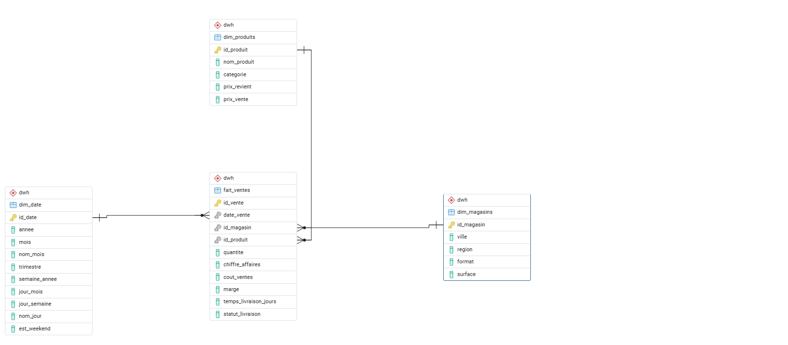

# retail-datawarehouse
Projet de datawarehouse pour une chaîne de distribution (retail)

## Architecture des Données & Flux ETL

Le projet respecte une architecture ELT/ETL standard divisée en deux couches distinctes :

1. **Couche Staging (`staging`) :** Zone d'atterrissage des données brutes. Les données des fichiers CSV (`ventes.csv`, `magasins.csv`, `produits.csv`) sont ingérées telles quelles via le script Python dans des tables miroirs temporaires.
2. **Couche Décisionnelle (`dwh`) :** Le modèle en étoile final où les données sont nettoyées, typées, liées par des clés étrangères et enrichies (notamment avec la dimension temporelle).

### Modèle en Étoile Final (Couche `dwh`)

*   **Table de faits :** `fait_ventes` (contient les indicateurs de chiffre d'affaires, marges, volumes et délais de livraison).
*   **Dimensions :** `dim_magasins`, `dim_produits`, `dim_date`.
