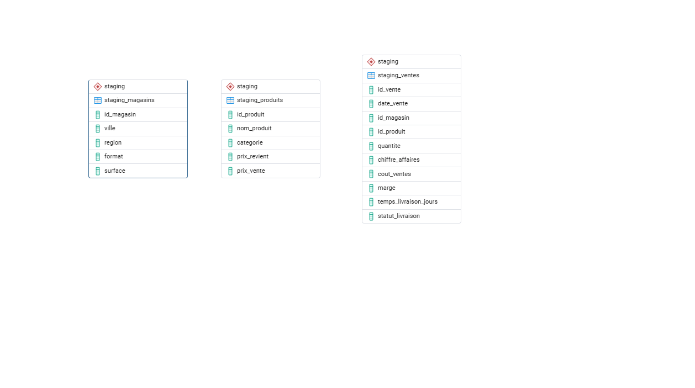

# retail-datawarehouse
Projet de datawarehouse pour une chaîne de distribution (retail)

## Architecture des Données & Flux ETL

Le projet respecte une architecture ELT/ETL standard divisée en deux couches distinctes :

1. **Couche Staging (`staging`) :** Zone d'atterrissage des données brutes. Les données des fichiers CSV (`ventes.csv`, `magasins.csv`, `produits.csv`) sont ingérées telles quelles via le script Python dans des tables miroirs temporaires.
2. **Couche Décisionnelle (`dwh`) :** Le modèle en étoile final où les données sont nettoyées, typées, liées par des clés étrangères et enrichies (notamment avec la dimension temporelle).

### Tables de Staging (`stg`)

### Modèle en Étoile Final (Couche `dwh`)

*   **Table de faits :** `fait_ventes` (contient les indicateurs de chiffre d'affaires, marges, volumes et délais de livraison).
*   **Dimensions :** `dim_magasins`, `dim_produits`, `dim_date`.

## 📈 Exemples d'Analyses Décisionnelles (SQL)

Le modèle en étoile permet d'exécuter des requêtes analytiques complexes de manière très performante. Voici quelques indicateurs clés développés dans le projet :

*   **Suivi Mensuel du CA & des Marges :** Analyse de l'évolution de la rentabilité (Chiffre d'Affaires, somme des marges et taux moyen de marge) sur l'année 2024.
*   **Analyse Croisée Multi-dimensionnelle :** Utilisation de l'opérateur avancé `CUBE` pour analyser les marges générées simultanément par le format des magasins et la catégorie des produits.
*   **Performance Logistique :** Suivi du délai moyen de livraison par région de magasin pour identifier d'éventuels retards.
*   **Performance Produits :** Top 5 des produits générant le plus de marge.
*   **Rendement Commercial :** Analyse de l'impact de la taille des magasins en calculant le Chiffre d'Affaires généré par mètre carré ($CA/m^2$).
